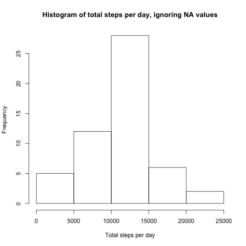

<!-- rmarkdown v1 -->
## Brief Introduction
I developed this R Markdown document and code using RStudio on Mac, version 0.98.0191.  In addition to base R, I used dplyr, ggplot2, and chron for various features and functions.  During the development of this markdown document and associated code, an error was encountered whereby I had to manually depricate from R Markdown V2, to R Markdown v1.  Thanks to various posts on stackoverflow for pointing me in the right direction.  Ultimately, due to some of the templating in the version of the cloned repository, the absolute paths used for the plots were not being recognized.  Given more time, I would investigate the issue further and resolve.  

## Loading and preprocessing the data
In this section, I load the libraries that I am going to utilize for the analysis, read in the data from the data file, then convert the date from a factor to a date format.  

```r
library(dplyr)
```

```
## 
## Attaching package: 'dplyr'
## 
## The following object is masked from 'package:stats':
## 
##     filter
## 
## The following objects are masked from 'package:base':
## 
##     intersect, setdiff, setequal, union
```

```r
library(ggplot2)
library(chron)
stepsData <- read.csv("activity.csv")
stepsData$date <- as.Date(stepsData$date, format = "%Y-%m-%d")
```
## What is mean total number of steps taken per day?
Per the assignment, we were to develop a histogram of the steps total taken per day.  In addition to the histogram, I have included the data frame that shows the aggregated total daily steps.  I used the aggregate() and cut() functions to easily parse the data into categories that can then be plotted using the base R plot fuction hist(). Per the assignment, NAs were ignored.

```r
totalSteps <- aggregate(steps ~ cut(date, "1 day"), stepsData, sum)
print(totalSteps)
```

```
##    cut(date, "1 day") steps
## 1          2012-10-02   126
## 2          2012-10-03 11352
## 3          2012-10-04 12116
## 4          2012-10-05 13294
## 5          2012-10-06 15420
## 6          2012-10-07 11015
## 7          2012-10-09 12811
## 8          2012-10-10  9900
## 9          2012-10-11 10304
## 10         2012-10-12 17382
## 11         2012-10-13 12426
## 12         2012-10-14 15098
## 13         2012-10-15 10139
## 14         2012-10-16 15084
## 15         2012-10-17 13452
## 16         2012-10-18 10056
## 17         2012-10-19 11829
## 18         2012-10-20 10395
## 19         2012-10-21  8821
## 20         2012-10-22 13460
## 21         2012-10-23  8918
## 22         2012-10-24  8355
## 23         2012-10-25  2492
## 24         2012-10-26  6778
## 25         2012-10-27 10119
## 26         2012-10-28 11458
## 27         2012-10-29  5018
## 28         2012-10-30  9819
## 29         2012-10-31 15414
## 30         2012-11-02 10600
## 31         2012-11-03 10571
## 32         2012-11-05 10439
## 33         2012-11-06  8334
## 34         2012-11-07 12883
## 35         2012-11-08  3219
## 36         2012-11-11 12608
## 37         2012-11-12 10765
## 38         2012-11-13  7336
## 39         2012-11-15    41
## 40         2012-11-16  5441
## 41         2012-11-17 14339
## 42         2012-11-18 15110
## 43         2012-11-19  8841
## 44         2012-11-20  4472
## 45         2012-11-21 12787
## 46         2012-11-22 20427
## 47         2012-11-23 21194
## 48         2012-11-24 14478
## 49         2012-11-25 11834
## 50         2012-11-26 11162
## 51         2012-11-27 13646
## 52         2012-11-28 10183
## 53         2012-11-29  7047
```


```r
hist(totalSteps$steps, xlab = "Total steps per day", main = "Histogram of total steps per day, ignoring NA values")
```

 
<br>

### Mean number of steps
Below is the mean number of steps taken per day.  

```r
meanSteps <- mean(totalSteps$steps)
print(meanSteps)
```

```
## [1] 10766.19
```
### Median Number of steps
Below is the median number of steps taken per day.

```r
medianSteps <- median(totalSteps$steps)
print(medianSteps)
```

```
## [1] 10765
```
As we can see, the daily mean and the median are nearly identical.  This means that if we are to consider using the mean or the median across intervals for replacing NA values, we can use either.

## What is the average daily activity pattern?
The data for this plot were grouped by interval and then summarized by the mean steps per interval across all days.  For this analysis, I used the dplyr library, which allows for easy grouping of data, specifially the group_by() and summarize() functions.  For the plot I used ggplot() from the ggplot2 library.

```r
intervalActivity <- stepsData %>%
  group_by(interval) %>%
  summarize(meanSteps = mean(steps, na.rm = TRUE)) 

meanStepsData <- ggplot(intervalActivity, aes(interval, meanSteps))
meanStepsPlot <- meanStepsData + geom_line() + ggtitle("Daily Activity Pattern Per Interval")
print(meanStepsPlot)
```

 
## Max average steps taken in a given interval
Per the description, we were asked to consider which interval contains the max number of steps, on average.  The max number of steps taken and the interval in which those were taken are printed below.


```r
maxSteps <- max(intervalActivity$meanSteps, na.rm = TRUE)
print(intervalActivity$meanSteps)
```

```
##   [1]   1.7169811   0.3396226   0.1320755   0.1509434   0.0754717
##   [6]   2.0943396   0.5283019   0.8679245   0.0000000   1.4716981
##  [11]   0.3018868   0.1320755   0.3207547   0.6792453   0.1509434
##  [16]   0.3396226   0.0000000   1.1132075   1.8301887   0.1698113
##  [21]   0.1698113   0.3773585   0.2641509   0.0000000   0.0000000
##  [26]   0.0000000   1.1320755   0.0000000   0.0000000   0.1320755
##  [31]   0.0000000   0.2264151   0.0000000   0.0000000   1.5471698
##  [36]   0.9433962   0.0000000   0.0000000   0.0000000   0.0000000
##  [41]   0.2075472   0.6226415   1.6226415   0.5849057   0.4905660
##  [46]   0.0754717   0.0000000   0.0000000   1.1886792   0.9433962
##  [51]   2.5660377   0.0000000   0.3396226   0.3584906   4.1132075
##  [56]   0.6603774   3.4905660   0.8301887   3.1132075   1.1132075
##  [61]   0.0000000   1.5660377   3.0000000   2.2452830   3.3207547
##  [66]   2.9622642   2.0943396   6.0566038  16.0188679  18.3396226
##  [71]  39.4528302  44.4905660  31.4905660  49.2641509  53.7735849
##  [76]  63.4528302  49.9622642  47.0754717  52.1509434  39.3396226
##  [81]  44.0188679  44.1698113  37.3584906  49.0377358  43.8113208
##  [86]  44.3773585  50.5094340  54.5094340  49.9245283  50.9811321
##  [91]  55.6792453  44.3207547  52.2641509  69.5471698  57.8490566
##  [96]  56.1509434  73.3773585  68.2075472 129.4339623 157.5283019
## [101] 171.1509434 155.3962264 177.3018868 206.1698113 195.9245283
## [106] 179.5660377 183.3962264 167.0188679 143.4528302 124.0377358
## [111] 109.1132075 108.1132075 103.7169811  95.9622642  66.2075472
## [116]  45.2264151  24.7924528  38.7547170  34.9811321  21.0566038
## [121]  40.5660377  26.9811321  42.4150943  52.6603774  38.9245283
## [126]  50.7924528  44.2830189  37.4150943  34.6981132  28.3396226
## [131]  25.0943396  31.9433962  31.3584906  29.6792453  21.3207547
## [136]  25.5471698  28.3773585  26.4716981  33.4339623  49.9811321
## [141]  42.0377358  44.6037736  46.0377358  59.1886792  63.8679245
## [146]  87.6981132  94.8490566  92.7735849  63.3962264  50.1698113
## [151]  54.4716981  32.4150943  26.5283019  37.7358491  45.0566038
## [156]  67.2830189  42.3396226  39.8867925  43.2641509  40.9811321
## [161]  46.2452830  56.4339623  42.7547170  25.1320755  39.9622642
## [166]  53.5471698  47.3207547  60.8113208  55.7547170  51.9622642
## [171]  43.5849057  48.6981132  35.4716981  37.5471698  41.8490566
## [176]  27.5094340  17.1132075  26.0754717  43.6226415  43.7735849
## [181]  30.0188679  36.0754717  35.4905660  38.8490566  45.9622642
## [186]  47.7547170  48.1320755  65.3207547  82.9056604  98.6603774
## [191] 102.1132075  83.9622642  62.1320755  64.1320755  74.5471698
## [196]  63.1698113  56.9056604  59.7735849  43.8679245  38.5660377
## [201]  44.6603774  45.4528302  46.2075472  43.6792453  46.6226415
## [206]  56.3018868  50.7169811  61.2264151  72.7169811  78.9433962
## [211]  68.9433962  59.6603774  75.0943396  56.5094340  34.7735849
## [216]  37.4528302  40.6792453  58.0188679  74.6981132  85.3207547
## [221]  59.2641509  67.7735849  77.6981132  74.2452830  85.3396226
## [226]  99.4528302  86.5849057  85.6037736  84.8679245  77.8301887
## [231]  58.0377358  53.3584906  36.3207547  20.7169811  27.3962264
## [236]  40.0188679  30.2075472  25.5471698  45.6603774  33.5283019
## [241]  19.6226415  19.0188679  19.3396226  33.3396226  26.8113208
## [246]  21.1698113  27.3018868  21.3396226  19.5471698  21.3207547
## [251]  32.3018868  20.1509434  15.9433962  17.2264151  23.4528302
## [256]  19.2452830  12.4528302   8.0188679  14.6603774  16.3018868
## [261]   8.6792453   7.7924528   8.1320755   2.6226415   1.4528302
## [266]   3.6792453   4.8113208   8.5094340   7.0754717   8.6981132
## [271]   9.7547170   2.2075472   0.3207547   0.1132075   1.6037736
## [276]   4.6037736   3.3018868   2.8490566   0.0000000   0.8301887
## [281]   0.9622642   1.5849057   2.6037736   4.6981132   3.3018868
## [286]   0.6415094   0.2264151   1.0754717
```

```r
print(maxSteps)
```

```
## [1] 206.1698
```

```r
print(which.max(intervalActivity$meanSteps))
```

```
## [1] 104
```
<br>
I printed out the entire set of values because, based on the plot, the which.max() function did not seem to align with the interval values along the x-axis of the plot.  We can see that the max value is indeed in the 104th entry.  Since we have removed the NAs from the data set, but are still looking at all entries in the table, we can surmise that the max value is the 104th entry of the valid data points, but since we are excluding NAs from the data but still considering all data points, this likely accounts for the discrepancy.

## Imputing missing values
We were asked to consider and report how many records contained NA values.  The number of records with NA values is printed below.  

```r
## Get a count of the records with NAs
countNAs <- length(which(is.na(stepsData$steps)))
print(countNAs)
```

```
## [1] 2304
```

In considering how to account for NA values, there are several options.  In looking at our earlier analysis, using either the median or mean number of steps per interval is equally viable, due to how little variance there is between the two numbers.  In order to do this, I used functions from the dplyr library, mutate() and replace().  Thanks to various posts from stackoverflow for pointing me in the right direction.  

```r
removeNAMean <- stepsData %>%
  
  mutate(steps = replace(steps, is.na(steps), mean(steps, na.rm = TRUE)))
```

The histogram below was created using the base R plotting capability.  The data for the plot was prepared using dplyr functions aggregate() and cut().

```r
totalStepsRemoveNAs <- aggregate(steps ~ cut(date, "1 day"), removeNAMean, sum)
hist(totalStepsRemoveNAs$steps, xlab = "Total steps per day", main = "Histogram of total steps per day, NAs replaced with mean steps per interval")
```

 
<br>
### Mean number of steps after replacement with mean

```r
meanStepsRemoveNAs <- mean(totalStepsRemoveNAs$steps)
print(meanStepsRemoveNAs)
```

```
## [1] 10766.19
```
### Median Number of steps after replacement with mean

```r
medianStepsRemoveNAs <- median(totalStepsRemoveNAs$steps)
print(medianStepsRemoveNAs)
```

```
## [1] 10766.19
```
As we can see, replacing NAs with the mean steps per interval had no effect on the mean steps per day and only a marginal effect on the median number of steps per day.  
## Are there differences in activity patterns between weekdays and weekends?
The following plots present the activity across all intervals for weekdays and weekend days.  In order to prepare the data for the plot, I used the weekdays() function, and the chron library to determine the day of the week and then whether or not the day in question was a weekday or a weekend day.  I then replaced the boolean values (true/false) with (weekend/weekday) respectively.  I then used ggplot to plot a panel with two graphs, one for weekdays and one for weekend days.  

```r
##Add day of the week to the original data frame
removeNAMean$dayName <- weekdays(removeNAMean$date)

##Add weekend v. weekday factor
removeNAMean$isWeekend <- chron::is.weekend(removeNAMean$date)

removeNAMean$isWeekend <- gsub("TRUE", "Weekend", removeNAMean$isWeekend)
removeNAMean$isWeekend <- gsub("FALSE", "Weekday", removeNAMean$isWeekend)

activityByWeekday <- removeNAMean %>%
  group_by(interval, isWeekend) %>%
  summarize(meanSteps = mean(steps))

print(head(activityByWeekday))
```

```
## Source: local data frame [6 x 3]
## Groups: interval
## 
##   interval isWeekend meanSteps
## 1        0   Weekday  7.006569
## 2        0   Weekend  4.672825
## 3        5   Weekday  5.384347
## 4        5   Weekend  4.672825
## 5       10   Weekday  5.139902
## 6       10   Weekend  4.672825
```

```r
weekendStepsData <- ggplot(activityByWeekday, aes(x = interval, y = meanSteps, group = isWeekend)) + geom_line(colour = "blue") + ggtitle("Weekday compared to Weekend Steps by interval")
weekendStepsPlot <- weekendStepsData + facet_grid(isWeekend ~ .)
print(weekendStepsPlot)
```

 
<br>
As we can see from the plots, during the weekdays, more steps are taken earlier in the day.  We can also see where the NA values were replaced with the mean steps per interval and that there is a distinct pattern of time where there were no readings taken and where the readings taken were deemed NA.  Due to this, one could assume that additional analysis could be done and than applying the mean value to an NA reading would be applied more intelligently.  For example, for intervals that fall between midnight and 5am, any NA readings could be replaced with zero and at any other time during the day, NAs could be replaced with the mean or median steps per interval.

